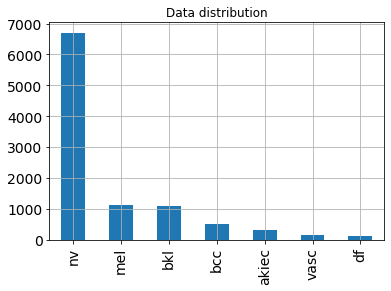
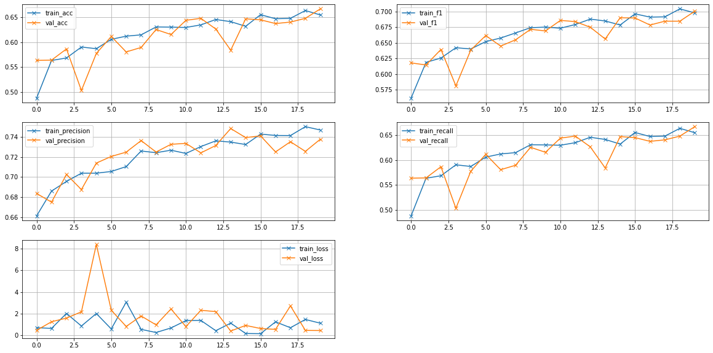
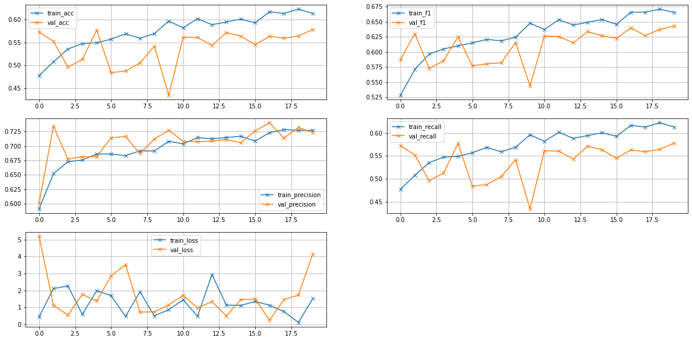

# lsml2_final_project: Skin Cancer classification using Resnet


## Introduction

This project is about a skin cancer classification project. In this project, I simply divied it into two parts: Model training part and docker part. 

First, in model training part, I will use [HAM10000](https://www.kaggle.com/datasets/kmader/skin-cancer-mnist-ham10000) dataset to train a Resnet model from scratch. And save the best performance model.

Second, in docker part, I will use a django framework as backend, and design a simple HTML frontend for uploading a skin image. Once the skin image is uploaded, it will pass it to the best performance model for prediction, and finaly return the result to the HTML.

<div align="center">
    <a href="./">
        
    </a>
</div>

## Run instructions

### Quick start

1. Downlaod or clone this repo
``` shell
cd final_project_docker_part
```

2. docker-compose
``` shell
docker-compose up
```
After runing docker-compose up, it will start the local django server. And then open 127.0.0.1:8000

## Resnet model training part

<a href="https://colab.research.google.com/drive/1BQn7YQLfj5yJzhJfofESoc-8IaSr_RkG"></a>

In model training part, I used colab to train my model, you can use my colab notebook to reproduce the results.

### Dataset

In this project, I use [HAM10000](https://www.kaggle.com/datasets/kmader/skin-cancer-mnist-ham10000) dataset to train a Resnet model from scratch.

<div align="center">
	
</div>

The dataset (6GB) contains 10015 images and 1 ground truth response CSV file. 

Cases include a representative collection of all important diagnostic categories in the realm of pigmented lesions: 
- Actinic keratoses and intraepithelial carcinoma / Bowen's disease (akiec)
- basal cell carcinoma (bcc)
- benign keratosis-like lesions (solar lentigines / seborrheic keratoses and lichen-planus like keratoses, bkl)
- dermatofibroma (df)
- melanoma (mel)
- melanocytic nevi (nv)
- vascular lesions (angiomas, angiokeratomas, pyogenic granulomas and hemorrhage, vasc).

For preparing the dataset, split them, 60% goes to training set, 20% goes to validating set and the rest goes to the testing set.

For passing data to dataloader easily, I moved X_train into dataset/train, X_val to dataset/val and X_test to dataset/test, and for each class, make a folder name with class name and store the corresponding images. Just like the figure shows below.

<div align="center">
	
</div>

Furthermore, I also uploaded this dataset to my google drive, you can also use this [link](https://drive.google.com/drive/folders/1U1jRNoDF1-__qIWq1Q0tHjuOXUrXF0VV?usp=sharing) to access this dataset, and create a shortcut to your google drvie.

### Architecture, losses, metrics

The model Architecture, I select two models as candidantes. Resnet18 and Resnet50, neither of them don't use pretrain. I train the model from scratch.

For the losses part, I noticed that the dataset is imbalance, hence, I will use weighted cross entropy as the loss function.

<div align="center">
    <a href="./">
        
    </a>
</div>

And for the metrics, I will use F1-score as the main metric to evulate the model performance because of imbalance dataset.

### Training details

For Resnet18, I trained 20 epochs, use AdamW as optimizer, and the plot of training history is shown below.

<div align="center">
    <a href="./">
        
    </a>
</div>

After training 20 epochs, we can find that the loss not decrease significantly. At 19 epoch, has the highest f1-score, so I will select this model as the best resnet18 model.

For Resnet50, with same hyperparameters as Resnet18, also trained 20 epochs, use AdamW as optimizer, and the plot of training history is shown below.

<div align="center">
    <a href="./">
        
    </a>
</div>

We can find that at 16 epoch, the model has the lowest loss. After 16 epoch, the loss slightly increases, it refers to overfit. Hence, I will stop at 16 epoch, and use this model as the best resnet50 model.

### Testing Model

Finally, I use the testing set test both Resnet18 and Resnet50, and the result is shown below.

| Model | Acc | F1-score | Precision | Recall |
| :-- | :-: | :-: | :-: | :-: |
| Resnet18 | **0.650** | **0.691** | **0.736** | **0.651** |
| Resnet50 | 0.550 | 0.627 | 0.730 | 0.550 |

We can find that the performance (f1-score) of resnet18 is better than resnet50. Because in this project, I didn't use pretrain resnet, and we only have around 6,000 images for training, besides, the dataset is very imbalance. Hence, it might not have enough images to update the weights in the resnet50. So in this case, a small model might performs better.
