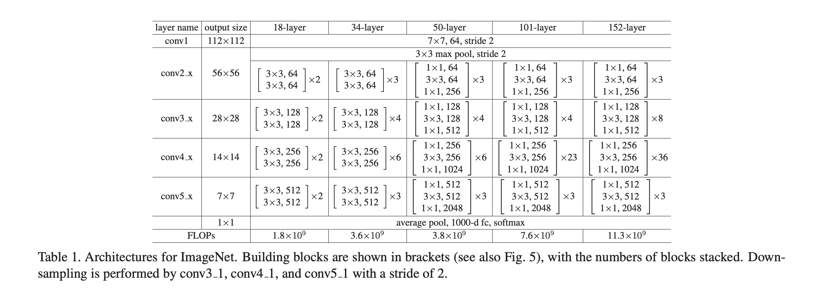

# lsml2_final_project: Skin Cancer classification using Resnet


## Project introduction

This project is about a skin cancer classification project. In this project, I simply divied it into two parts: Model training part and docker part. 

First, in model training part, I will use [HAM10000](https://www.kaggle.com/datasets/kmader/skin-cancer-mnist-ham10000) dataset to train Resnet18 model and Resnet50 model from scratch. And then I will compare which model has the best performance on testing set, and use the model as the final model.

Second, in docker part, I will use a django framework as backend, and design a simple HTML website as frontend for uploading a skin image. Once the skin image is uploaded, it will pass it to the best model for prediction, and finally return the prediction to the HTML.

And the gif below shows how the website works:

<div align="center">
    <a href="./">
        
    </a>
</div>

## Run instructions

### Quick start

1. Downlaod or clone this repo, then cd to the final_project_docker_part folder.
``` shell
cd final_project_docker_part
```

This folder contains a `docker-compose.yml` file.

2. docker-compose
``` shell
docker-compose up
```

After runing docker-compose up, it will start the local django server. And then open 127.0.0.1:8000 in your browser, it will show the skin cancer detection page as we mentioned.

## Resnet model training part

<a href="https://colab.research.google.com/drive/1BQn7YQLfj5yJzhJfofESoc-8IaSr_RkG"></a>

In model training part, I used colab to train my model, you can use my colab notebook to reproduce the results. And the other file such as dataset or model weights file, you can also download from my [google drive](https://drive.google.com/drive/folders/1NYGRt4IW5LdpGhsNGUloq4Eh298qK4ew?usp=share_link)

### Dataset

In this project, I use [HAM10000](https://www.kaggle.com/datasets/kmader/skin-cancer-mnist-ham10000) dataset to train a Resnet model from scratch.

<div align="center">
	
</div>

The dataset (6GB) contains 10015 images and 1 ground truth response CSV file. 

Cases include a representative collection of all important diagnostic categories in the realm of pigmented lesions: 
- Actinic keratoses and intraepithelial carcinoma / Bowen's disease (akiec)
- basal cell carcinoma (bcc)
- benign keratosis-like lesions (solar lentigines / seborrheic keratoses and lichen-planus like keratoses, bkl)
- dermatofibroma (df)
- melanoma (mel)
- melanocytic nevi (nv)
- vascular lesions (angiomas, angiokeratomas, pyogenic granulomas and hemorrhage, vasc).

For preparing the dataset, split them, 60% goes to training set, 20% goes to validating set and the rest goes to the testing set.

For passing data to dataloader easily, I moved X_train into dataset/train, X_val to dataset/val and X_test to dataset/test, and for each class, make a folder name with class name and store the corresponding images. Just like the figure shows below.

<div align="center">
	
</div>

Furthermore, I also uploaded this dataset to my google drive, you can also use this [link](https://drive.google.com/drive/folders/1U1jRNoDF1-__qIWq1Q0tHjuOXUrXF0VV?usp=sharing) to access this dataset, and create a shortcut to your google drvie.

### Architecture, losses, metrics

The model Architecture, I select two models as candidantes. Resnet18 and Resnet50, none of them use pre-trained. I train the model from scratch.

<div align="center">
    <a href="./">
        
    </a>
</div>
Source: [Deep Residual Learning for Image Recognition](https://openaccess.thecvf.com/content_cvpr_2016/papers/He_Deep_Residual_Learning_CVPR_2016_paper.pdf)

For the losses part, I noticed that the dataset is imbalance, hence, I will use weighted cross entropy as the loss function.

<div align="center">
    <a href="./">
        
    </a>
</div>

And for the metrics, I will use F1-score as the main metric to evaluate the model performance because of imbalance dataset.

### Training details

For Resnet18, I trained 20 epochs, use AdamW as optimizer, and the plot of training history is shown below.

<div align="center">
    <a href="./">
        
    </a>
</div>

After training 20 epochs, we can find that the loss not decrease significantly. At 19 epoch, has the highest f1-score, so I will select this model as the best resnet18 model.

For Resnet50, with same hyperparameters as Resnet18, also trained 20 epochs, use AdamW as optimizer, and the plot of training history is shown below.

<div align="center">
    <a href="./">
        
    </a>
</div>

We can find that at 16 epoch, the model has the lowest loss. After 16 epoch, the loss slightly increases, it refers to overfit. Hence, I will stop at 16 epoch, and use this model as the best resnet50 model.

#### Knowledge distillation

For improving the performance of the model, I select a pre-trained convnext large model for transfer learning, and then I will apply knowledge distillation, use this model as teacher to teach our pervious resnet18 model

The figure shows below is the training history of the convnext model, I train it 7 epochs, and at the 4 epoch, it has the best f1 score on validation set, around 85%, so I stop at this epoch.

<div align="center">
    <a href="./">
        
    </a>
</div>

Next, distilling the knowledge from ConvNeXt to Resnet18, I use grid search to find the best alpha and temperature. 

- alpha list: [0.1, 0.3, 0.5, 0.7, 0.9]
- temperature list: [1, 5, 10, 15, 20]

I ran total 25 experiments. finally the best hyperparameters in distillation part is alpha = 0.5 and temperature = 15, the f1 of resnet18 = 73%.

### Testing Model

In this part, I use the testing set test different models, and the result is shown below.

| Model | Acc | F1-score | Precision | Recall | Size |
| :-- | :-: | :-: | :-: | :-: | :-: |
| Resnet18 | 0.650 | 0.691 | 0.736 | 0.651 | 45.8mb |
| Resnet50 | 0.550 | 0.627 | 0.730 | 0.550 | 100.2mb |
| Distill Resnet18 | 0.731 | 0.731 | 0.726 | 0.736 | 45.8mb |
| ConvNeXt large | 0.841 | 0.849 | 0.857 | 0.841 | 766.7mb |

We can find that the performance (f1-score) of resnet18 is better than resnet50. Because in this project, I didn't use pretrain resnet, and we only have around 6,000 images for training, besides, the dataset is very imbalance. Hence, it might not have enough images to update the weights in the resnet50. So in this case, a small model might performs better.

And the f1 score of Distill Resnet18 on testing set is 73.1%, better than the resnet18 training from scratch 69.1%, it almost improves 4%.

Although the performance of distill resnet18 is not as good as the teacher model (f1=84.9%), but if we take the model size into account, the resnet18 only takes 45.8mb, and the convnext takes 766.7mb.

## Service deployment and usage instructions

### dockerfile and docker-compose file

In `dockerfile`, it mainly install requirements, and run the cmd: python manage.py runserver 0.0.0.0:8000
- Django==3.2.8
- djangorestframework==3.12.4
- psycopg2==2.9.1
- Pillow
- torchvision
- torch 

In `docker-compose.yml` file, since I've already built the django project, so this file mainly for making migration, for propagating changes things (adding a field, deleting a model, etc.) into the database schema.

### required services: databases

In this project, I used postgres.

### client for service

In the frontend part, I simply made a HTML website for sevice. Client can easily upload an image of skin via the HTML website, and the image will be passed to the resnet model for prediction, and finally return the prediction to the HTML. The demonstration gif is shown at [Project introduction](https://github.com/ccng830/lsml2_final_project#project-introduction) part.

Furthermore, the service is a synchronous project.

### Usage instructions

Refers to [Quick start](https://github.com/ccng830/lsml2_final_project#quick-start)
